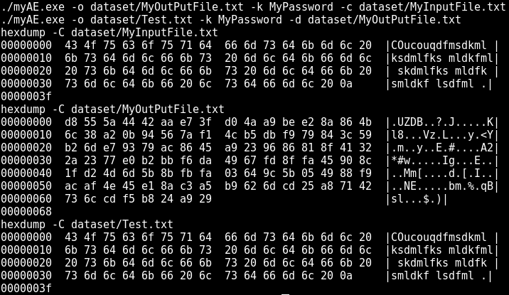
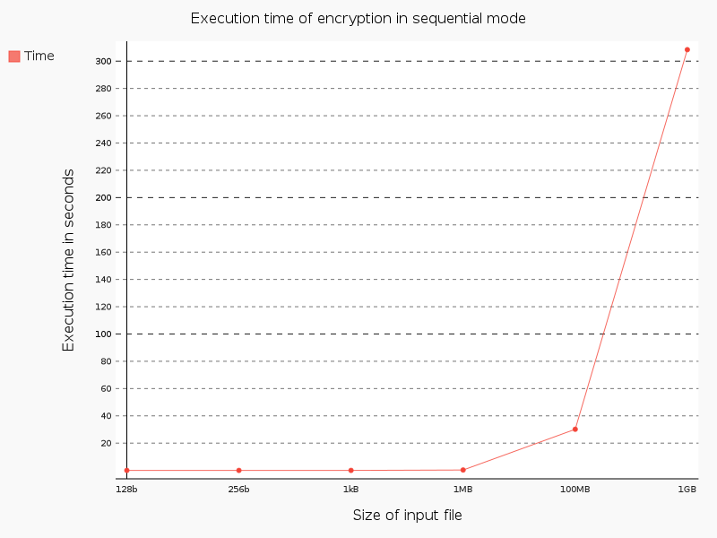
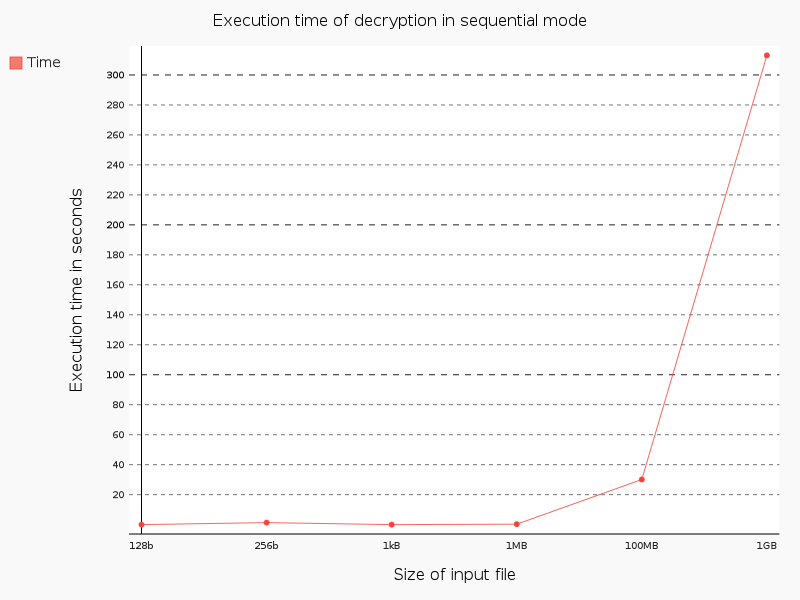

Rapport du projet de BCS
========================

Ceci est le rapport du projet de BCS de **Andriamilanto Tompoariniaina** et de
**Christophe Genevey-metat**.

## Fonctionnement de notre outil de chiffrement authentifié
Dans cette partie, nous allons décrire le fonctionnement de notre chiffrement
authentifié ainsi que les différents blocs qui le composent.

### Mode CTR comme méthode de chiffrement par bloc
Comme méthode de chiffrement par bloc, nous avons choisi CTR (Counter) pour
essayer une autre méthode que celles traditionnellement utilisées telles que CBC
ou ECB. De plus, il nous réduit le travail puisque pour chiffrer et déchiffrer,
on a uniquement besoin d'un algorithme de chiffrement par bloc, la différence
étant l'élément qu'on prendra pour effectuer un xor avec le résultat. On
effectuera un xor avec le résultat et le texte en clair pour obtenir le chiffré,
et inversement.

Nous avions aussi choisis le mode CTR car nous pensions expérimenter une
implémentation parallèle de l'algorithme mais par faute de temps nous n'avions
pu la faire.

#### Chiffrement en mode CTR
Ci-dessous, le mode de fonctionnement du chiffrement en CTR.

#### Déchiffrement en mode CTR
Ci-dessous, le mode de fonctionnement du déchiffrement en CTR.

### AES256 comme algorithme de chiffrement par bloc
Comme on peut le voir, le fonctionnement du chiffrement par bloc en mode CTR
nécessite un algorithme de chiffrement par bloc qui prendra comme entrée un
compteur unique dérivé à partir de l'IV et d'une clef. La taille de ces deux
entrées dépendant énormément de l'algorithme choisis, nous allons d'abord
décrire quel est l'algorithme choisis afin de justifier nos choix pour les
entrées.

L'algorithme que nous avons choisis pour le chiffrement par bloc est l'AES qui
utilise un réseau de substitution et de permutation. Le message clair en entrée
de cet algorithme est un bloc de 128 bits, soit 16 octets, et la clef en entrée
peut faire 128, 192 ou 256 bits. Nous avons donc pris la version AES256 prenant
une clef de 256 bits, soit 32 octets, et effectuant 14 tours.

### Génération de la clef
Pour ce qui est de la clef, nous avions choisis tout simplement de hasher la
clef fournie en tant que chaîne de charactère en utilisant l'algorithme de
hashage SHA3-256 qui est une des dernières versions de SHA et qui nous permet
d'obtenir directement une clef de la bonne taille pour l'algorithme AES256.

### Génération du compteur
Pour ce qui est de la dérivation du compteur à partir de l'IV, nous avions
choisis le mode de fonctionnement suivant.

#### IV généré via MRG32k3a
L'Initialization Vector est un *double* sur 8 octets généré pseudo-aléatoirement
via l'algorithme MRG32k3a, que nous avions vu lors des cours sur la génération
de nombres pseudo-aléatoires, qui possède une bonne entropie. Cependant,
l'algorithme se base sur un seed que nous avions définis comme étant simplement
le timestamp actuel de la machine.

#### Calcul du compteur unique
Le mode CTR requiert que chaque bloc soit chiffré avec un compteur unique. Pour
construire celui-ci, nous définissons un identifiant unique à chaque bloc grâce
à un simple compteur définis en tant que *double* sur 8 octets allant donc de 0
jusqu'à [val_max_double]. Enfin, nous définissons le compteur unique comme étant
la concaténation des octets de l'IV avec les octets de cet identifiant unique.

### Gestion du code d'Authentification
Pour ce qui est de la gestion du code d'authentification, nous avons choisis le
mode Encrypt-then-MAC en utilisant un HMAC basé sur la fonction de hashage déjà
présente, SHA3-256. Le MAC est ajouté à la fin du fichier chiffré et lors du
déchiffrement il est d'abord vérifié avant de l'exécuter.

### Format du fichier chiffré
Le chiffré est du format suivant:

L'IV fait 8 octets, le chiffré fait une taille dynamique et le MAC fait 32 octets.

## Compilation, création des datasets et exécution

### Compilation et exécution
Afin de compiler le programme, il suffit d'exécuter la commande `make` à la
source du projet où se trouve le `makefile`.

Pour l'exécuter, la syntaxe est la suivante pour le chiffrement `./myAE -c
[file_in] -o [file_out] -k [password]` et `./myAE -d [file_in] -o [file_out] -k
[password]` pour le déchiffrement. Notez qu'il est possible d'interchanger
l'ordre des paramètres.

### Génération des datasets et exécution des tests
Afin de générer les données de test et le rapport, nous avions développer un
petit outil en python. Pour l'exécuter, il faudra d'abord installer les
dépendances python nécessaires via la commande `sudo pip3 install -r
report/pip-requirements.txt` ou bien `make install_python_requirements`.

Par la suite, il vous suffit simplement de l'exécuter via `make execute_tests`
ou bien `./src/runner.py` ou `python3 ./src/runner.py`. Il vous proposera
d'abord de générer les données de tests, entrez `y` pour le faire ou tout autre
charactère pour ignorer la génération.

Les données de tests sont des fichiers binaires aléatoires d'un certain nombre
d'octets (128b, 256b, 1ko, 1Mo, 100Mo et 1Go) qui seront stockés dans le dossier
*dataset* et seront nommés en fonction de leur taille. Cette génération peut
prendre un certains temps car le plus gros fichier fait 1Go.

Enfin, cet outil permet d'exécuter les chiffrements et déchiffrements sur ces
données de test, mesurer le temps d'exécution et retourner les résultats sous
forme de graphiques dans deux fichiers dans le dossier *report* nommés
respectivement *encryption_sequential.png* et *decryption_sequential.png*.

## Tests et résultats

### Démonstration

Voici un exemple simple du fonctionnement de notre chiffrement authentifié ainsi
que notre déchiffrement.

Voici une demonstration :

On peut voir sur l'exemple 3 fichiers, le premier fichier *MyInputFile.txt* est
le fichier contenant le message claire, le deuxième fichier *MyOutPutFile.txt*
est le fichier contenant le message chiffré et enfin le troisième fichier
*Test.txt* contenant le message déchiffré. Ainsi on voit bien que notre
programme arrive bien à chiffrer notre message et arrive bien à le déchiffrer
car le message déchiffré est identique au message clair.

Vous pouvez exécuter ce test en utilisant la commande `make test` directement à
partir du dossier source.

### Mesure du temps d'exécution
Ci-dessous le graphique présentant le temps d'exécution du chiffrement en mode
séquentiel en fonction de la taille du message clair en entrée.

Ci-dessous le graphique présentant le temps d'exécution du déchiffrement en mode
séquentiel en fonction de la taille du chiffré en entrée.

